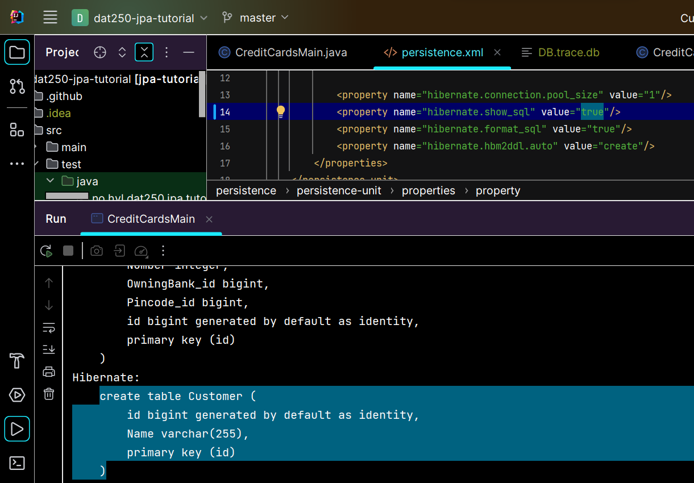
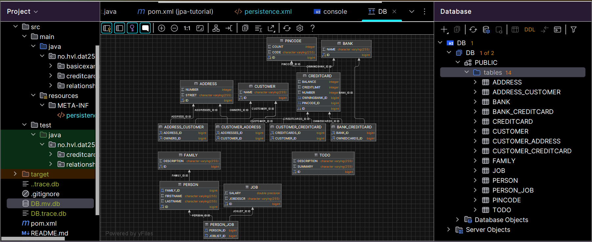

# Lab2 report

### Problems
There were no particular technical problems installing and using JPA.

### Link to code
https://github.com/WilliamWintersto/dat250-jpa-tutorial

### Questions

Where is the database? Explain the used database and how/when it runs.
- The database is in the top package "dat250-jpa-tutorial" with the name "DB.mv.db." and is initialized in the persistence.xml file.
On line 10 in persistence.xml, we can see that the driver class is H2, which is a relational database management system. It is an embedded database that is created trough the entity manager. On line 17 in CreditCardsMain.java the database is created. "entitymanager.gettransaction().begin()" initiates a new database transaction.

Can you provide the SQl used to create the table Customer (Hint: Hibernate is used for the object-relational-mapping)?
- Hibernate abstracts the SQL away from me, but by changing the "hibernate.show_sql" property in persistence.xml to true, it will print the SQL out in the console.

Find a way to inspect the database tables being created and attach a screenshot of the database schema to your report. Do the created tables correspond to your initial thoughts regarding the exercise? (an explanation of how you inspected the database tables and what tables were created. For the latter, you may provide screenshots.)
- I opened the database tool window and added my database with h2-2.2.220.jar as the driver. Now i could expand the database in the tool window to find all the tables.
That were created. Right clicking on the database and selecting "show diagram" opened the schema as seen on the image.

### Pending issues
As far as I know everything should be working now.
If not I must have misunderstood something.
