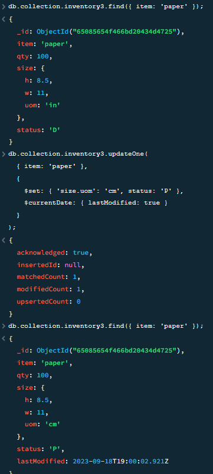

# Lab3 report

## Problems
One problem i had was when trying to validate the installation package was that the given scipt had a different version number. This caused an error when trying to validate, but was easily fixed my changing the version number in all locations.

## Experiment 1
Some of the script outputs were way longer than others so I ended up choosing the shorter ones.
### insert-documents
Inserting canvas item and finding it in the database.

### query-documents
Find all documents where status = 'A' and qyt in less than 30.

### update-documents
Paper item before change, update the value of the size.uom field to "cm" and the value of the status field to "P", paper item after change.

### remove-documents

### bulk-write-operations

## Experiment 2

## Pending issues
As far as I know everything should be working.
