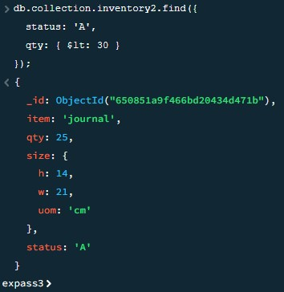

# Lab3 report

## Problems
One problem i had was when trying to validate the installation package was that the given scipt had a different version number. This caused an error when trying to validate, but was easily fixed my changing the version number in all locations.

## Experiment 1
Some of the script outputs were way longer than others so I ended up choosing the shorter ones.
### insert-documents
Inserting canvas item and finding it in the database.

### query-documents
Find all documents where status = 'A' and qyt in less than 30.

### update-documents
Paper item before change, update the value of the size.uom field to "cm" and the value of the status field to "P", paper item after change.

### remove-documents
See all documents, then delete everything and try to display all documents.

### bulk-write-operations
Before writing, then inserting, updating, deleting and replacing documents, then after writing.

## Experiment 2
Let's say we have a database that stores every item in a stores inventory. The owner wants to restock so that he has at least 100 of every item. The mapReduce function I have developed is useful in this situation because it will return the amount of money it will cost to restock all items with a quantity of less than 100, up to 100 again. In this situation the owner has to buy 75 journals costing 200 each and 50 notebooks costing 100 each. The mapReduce function tells us that it will cost 20000 which is correct (75 * 200 + 50 * 100 = 20000).

