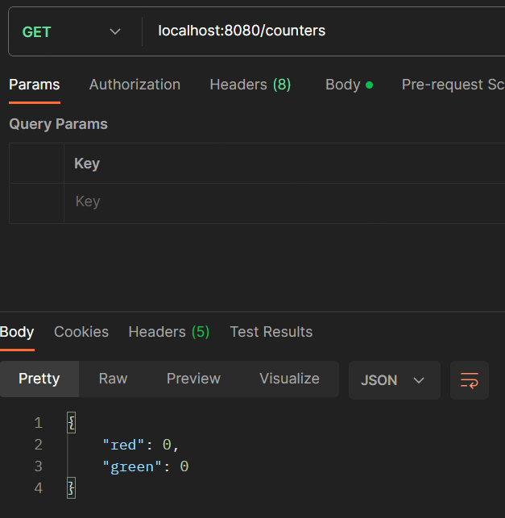
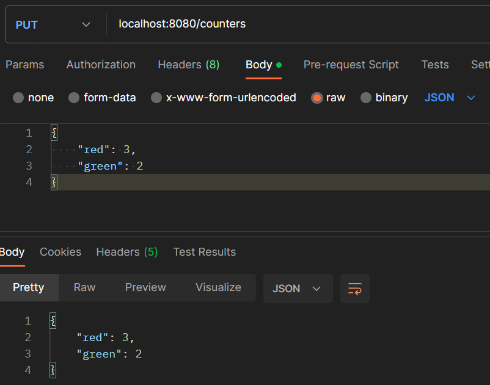
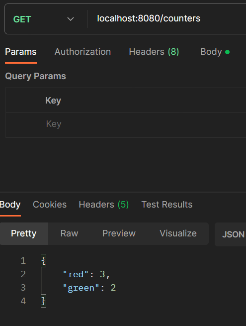

# Lab4 report

### Problems
No problems during installation.

### Link to code
https://github.com/WilliamWintersto/dat250-spring-counters-todos

### Experiment 1

#### Get request before put

#### Updating values with put

#### Get request after put

### Pending issues
As far as I know everything should be working now.
