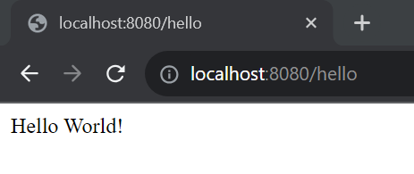
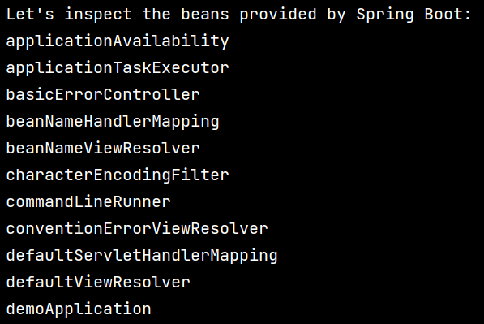
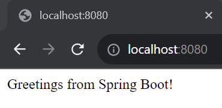
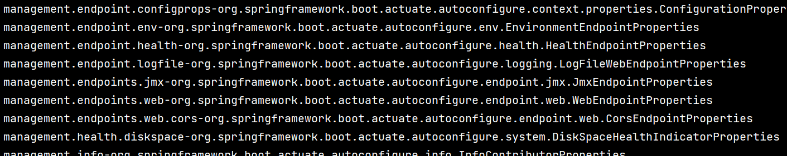
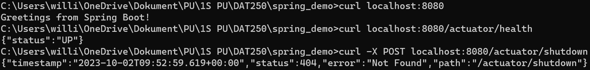
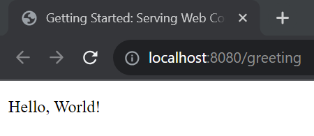
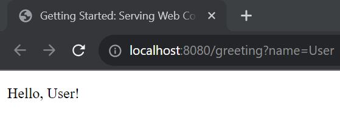
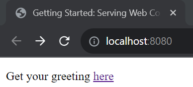
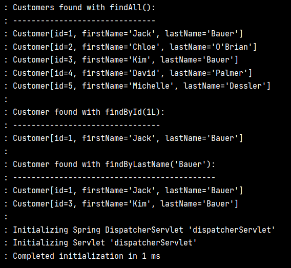

# Lab5 report

### Problems
No problems during installation.

### Link to code
-----TODO-----

### Experiment 1

### Experiment 2

### Experiment 3

### Experiment 4

### Pending issues
As far as I know everything should be working now.